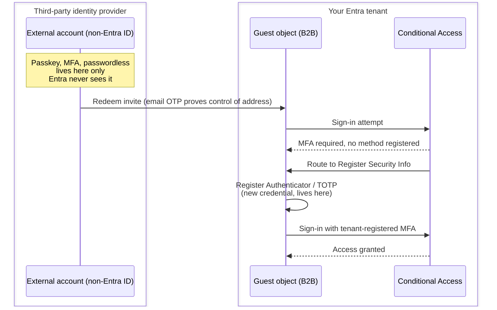

## Overview

SME tenants rarely have a clean guest list. A staff member shares a Word document with a client, the client's email is a plain consumer address with no organisational tenant behind it, and within minutes there's a guest object in your directory that nobody explicitly provisioned. Multiply that across a few dozen shares a year and you end up with a directory full of unmanaged, unaudited external identities. Worse yet, how can you even ensure these "Guests" follow good security hygiene like your users?

This article covers a baseline for locking that down without blocking the sharing your business actually needs: Conditional Access for guests, authentication method choices, Purview labelling, SharePoint/OneDrive sharing defaults, and ongoing guest lifecycle auditing.

## Guest personas

Not all external collaborators need the same treatment. Three common personas in an SME tenant:

- **One-off external share** - a client or supplier receiving a single document via a share link. Consumer email address with no organisation-managed tenant behind it, no existing relationship with your tenant.
- **Recurring contractor** - works with your team regularly, needs standing access to a SharePoint site or Teams channel over weeks or months. May or may not sit behind their own Entra tenant.
- **Partner organisation, ad-hoc** - the other side happens to run Entra, but nobody's configured anything between the two tenants. This is the everyday case: someone at your company emails someone at theirs, shares a doc, a guest invite goes out, done.
- **Partner organisation, deliberate B2B** - the same partner, but with cross-tenant access settings, an organisational relationship, or B2B Direct Connect deliberately configured for that specific tenant ID.

The third and fourth personas are easy to conflate but the distinction matters. B2B collaboration inbound and outbound are allowed for all users and all applications by default at the tenant level, so a plain end-user-initiated share to another Entra tenant already works out of the box with no admin setup, and is what actually happens in most SME-to-SME sharing. Deliberately configuring cross-tenant access settings for a specific partner is an optional upgrade on top of that default, not a prerequisite. It's out of scope for this baseline, see the appendix at the end for what it buys you and where to start.

Design Conditional Access and sharing policy around these personas rather than a single "guests" bucket. A one-off external share should stay frictionless and cheap to run: no manual admin step, no extra approval queue. A recurring contractor is worth a lighter-touch periodic check. A deliberately configured partner tenant is where [cross-tenant access settings](https://learn.microsoft.com/en-us/entra/external-id/cross-tenant-access-overview) actually do something beyond the default. The goal throughout is the minimum control that still gives you an audit trail, not the maximum control available.

### Why a named guest object beats an anonymous link

SharePoint and OneDrive can share a file two ways: an "Anyone with the link" link, or a "Specific people" link that provisions a named guest object in Entra. The anonymous link is faster to send and needs no sign-in at all, which is exactly why it's the wrong default for anything beyond genuinely public content.

With an anonymous link, the access log shows a link was used. It does not show who used it. If that link gets forwarded, screenshotted into a group chat, or leaked, there's no way to tell from the audit log alone. A named guest object, by contrast, gives every access event, every file open, and every sign-in an identity attached to it: `Get-MgUser -Filter "userType eq 'Guest'"` gives you the full list at any time, sign-in logs tie every access to that specific object, and removing access is a single `Remove-MgUser` rather than hunting down and rotating a link. The [SharePoint sharing documentation](https://learn.microsoft.com/en-us/sharepoint/turn-external-sharing-on-or-off) covers how to restrict sharing to "Existing guests" or "New and existing guests" to push behaviour toward named access without adding an approval step for staff.

## Cross-tenant inbound trust: what it does and doesn't cover

`Get-MgPolicyCrossTenantAccessPolicyDefault` returns an `InboundTrust` block:

```powershell
Connect-MgGraph -Scopes "Policy.Read.All"
Get-MgPolicyCrossTenantAccessPolicyDefault | Select-Object -ExpandProperty InboundTrust
```

`IsMfaAccepted`, `IsCompliantDeviceAccepted`, and `IsHybridAzureAdJoinedDeviceAccepted` only matter for guests coming from another **Entra** tenant. If the partner org's Conditional Access already enforced MFA on their side, trusting that claim means your guest isn't asked to re-authenticate on entry.

None of this applies to a consumer email account, or any third party that hasn't been deliberately set up as a real B2B Entra tenant. That address has no home Entra tenant, so there is no MFA claim to trust in the first place, regardless of what security features exist on the third party's own side, a passkey, passwordless sign-in, or any other strong authentication on their personal or organisational account with their own provider. Those guests will always need to satisfy your Conditional Access requirements using a credential registered directly in your tenant.


The diagram below makes the split explicit. Whatever strong authentication the third party already has lives entirely inside their own identity provider and secures sign-in to that provider only. It never crosses into your tenant. The credential Conditional Access actually checks is the one registered against the guest object in your directory, created during the security info step:



<script type="module">
  import mermaid from 'https://cdn.jsdelivr.net/npm/mermaid/dist/mermaid.esm.min.mjs';
  document.querySelectorAll('pre code.language-mermaid').forEach((el) => {
    const div = document.createElement('div');
    div.className = 'mermaid';
    div.textContent = el.textContent;
    el.parentElement.replaceWith(div);
  });
  mermaid.initialize({ startOnLoad: true, theme: 'dark', sequence: { boxMargin: 10, noteMargin: 10, actorMargin: 60, wrap: true } });
</script>

The identity provider box and the tenant box never exchange credential material directly. Everything crossing that boundary is a one-time proof (the OTP), never a reusable factor.

## The guest MFA registration deadlock

This is the failure mode worth planning around before it happens to a real client.

A common baseline pairs two Conditional Access policies: one requiring MFA for all guest sign-ins, and a second targeting the [`urn:user:registersecurityinfo` user action](https://learn.microsoft.com/en-us/entra/identity/conditional-access/concept-conditional-access-cloud-apps#user-actions) with a sign-in frequency requirement (forcing users to reconfirm strong authentication before they can register or change a method). If the second policy's scope includes guests, either directly or via a dynamic group that quietly picks them up, a first-time guest with no registered MFA method hits a deadlock: they can't register a method without already satisfying strong authentication, and they can't satisfy strong authentication without a registered method.


The sign-in log symptom is a hard failure against error code 53003 ("access has been blocked by conditional access"), with the failing policies visible in the **Conditional Access** tab of the sign-in event. One easy misdirection: the **Application** field on the sign-in often shows an internal auth surface like "Microsoft App Access Panel" rather than the document or site the guest was actually trying to reach. Conditional Access evaluates at the authentication layer, before the guest reaches the target resource, so **don't waste time checking permissions on the SharePoint site when the failure is happening one step earlier**.

The fix is to exclude guests from the register-security-info policy so they can reach the enrolment flow on first sign-in:

```powershell
Update-MgIdentityConditionalAccessPolicy -ConditionalAccessPolicyId $registerSecurityInfoPolicyId -Conditions @{
    Users = @{
        ExcludeGuestsOrExternalUsers = @{
            GuestOrExternalUserTypes = "internalGuest,b2bCollaborationGuest,b2bCollaborationMember,b2bDirectConnectUser,otherExternalUser"
            ExternalTenants = @{ MembershipKind = "all" }
        }
    }
}
```

The MFA requirement itself stays in place. Guests are simply no longer blocked from the registration step that satisfies it.

For a guest who still can't reach a working enrolment path (rare, but possible depending on the app they land in), an admin-issued [Temporary Access Pass](https://learn.microsoft.com/en-us/entra/identity/authentication/howto-authentication-temporary-access-pass) is the manual bootstrap:

```powershell
New-MgUserAuthenticationTemporaryAccessPassMethod -UserId $guestObjectId -BodyParameter @{ isUsableOnce = $true }
```

Share the resulting pass through a separate channel to the invite email, not inline in the same message.

## Authentication methods for guests

Once a guest clears Conditional Access and lands on security info registration, they need a method your [tenant's authentication methods policy](https://learn.microsoft.com/en-us/entra/identity/authentication/concept-authentication-methods-manage) actually allows:

```powershell
Get-MgPolicyAuthenticationMethodPolicy | Select-Object -ExpandProperty AuthenticationMethodConfigurations
```

For guest-facing scenarios, Microsoft Authenticator and any generic TOTP authenticator app (`SoftwareOath`) cover almost every case. A guest with no interest in installing Microsoft's app can register Google Authenticator, Authy, or any other TOTP app under "set up a different authenticator app" during the same enrolment flow, and it satisfies the MFA grant control identically.

This credential is entirely separate from anything on the guest's personal account. A passkey configured on a personal Microsoft account, or 2-step verification on a Google account, has no bearing here. The Authenticator or TOTP registration lives on the guest object inside your own directory and can be inspected or revoked independently:

```powershell
Get-MgUserAuthenticationMethod -UserId $guestObjectId
Remove-MgUserAuthenticationMicrosoftAuthenticatorMethod -UserId $guestObjectId -MicrosoftAuthenticatorAuthenticationMethodId $methodId
```

Revoking the method forces re-enrolment on next sign-in. Removing the guest object entirely (`Remove-MgUser`) is the clean cutoff when the collaboration ends.

Leave SMS and voice disabled in the authentication methods policy if they're not already, [retiring both in favour of passkeys and authenticator-based methods](https://buildtestrun.com/entra-passkey-default-sms-voice-retirement/) is worth doing tenant-wide, not just for guests. Both are much weaker than an authenticator app and add little for a guest scenario where TOTP works everywhere.

## SharePoint and OneDrive sharing defaults

Two settings matter most for the one-off share persona:

**Who can invite guests.** [`AllowInvitesFrom` in the authorization policy](https://learn.microsoft.com/en-us/entra/external-id/external-collaboration-settings-configure) controls whether any licensed user can trigger a guest invite just by sharing a document, with no admin involvement:

```powershell
Get-MgPolicyAuthorizationPolicy | Select-Object AllowInvitesFrom
```

The default (`everyone`) is what produces a guest object appearing in the directory the moment a staff member shares a file, before any admin has touched anything. That's not a bug, it's self-service B2B working as designed, but it's worth a deliberate decision for an SME: `adminsGuestInvitersAndAllMembers` still allows normal sharing while removing the ability for guests themselves to invite other guests.

**Unmanaged device restrictions.** [SharePoint's Conditional Access integration for unmanaged devices](https://learn.microsoft.com/en-us/sharepoint/control-access-from-unmanaged-devices) controls what a guest can do with content once they're in:

```powershell
Get-SPOTenant | Select-Object ConditionalAccessPolicy, LimitedAccessFileTypeForUnmanagedDevices
Set-SPOTenant -ConditionalAccessPolicy AllowLimitedAccess
```

`AllowLimitedAccess` gives a guest on a personal, unmanaged device browser-only viewing, with download, print, and sync blocked and a fixed banner explaining why. That banner's wording isn't customisable, it's built into the SharePoint Online web experience, but the restriction level is exactly the right default for external guests on devices you don't manage if you want that extra level of control over your tenants data.

Some collaborators genuinely need to download and edit in other apps, a contractor working offline, or a client's own document management workflow. This isn't a per-guest toggle, and it isn't a B2B tenant-trust question either. It's a per-site override: `Set-SPOSite -ConditionalAccessPolicy AllowFullAccess` on the specific site collection those collaborators use, leaving the tenant-wide default in place everywhere else. Designing which sites get the exception and how access to them is structured is its own topic and out of scope here.

### OneDrive share vs SharePoint site access, and who should add the guest

The one-off share and the recurring contractor personas usually end up on two different surfaces, and it's worth being deliberate about which one a given relationship belongs on.

A OneDrive share is a file or folder shared straight out of one person's personal storage. There's no site, no membership tiers, no owner beyond the individual who shared it, just a link with a permission level attached. It's exactly right for the one-off consumer share: fast, no setup, and the guest object it creates is easy to find and remove later. It's the wrong fit for anything ongoing, because access lives and dies with that one person's OneDrive, with no structure for anyone else to see who has what.

A SharePoint site, by contrast, has a defined membership model, Owners, Members, Visitors, so a recurring contractor or an ad-hoc partner relationship added to a site's Member group has access that's visible, reviewable, and revocable at the group level rather than by hunting down individual link shares scattered across different people's OneDrive. This is the right home for anything that outlasts a single document.

That leaves the gatekeeping question: should a site owner be able to add a guest directly, or should that go through an M365 admin? For an SME, the practical answer is usually the site owner, with admin oversight, not admin-as-bottleneck:

- The site owner has the business context. They know who the contractor is, why they need access, and when the engagement ends. An admin approving every request has none of that context and becomes a rubber stamp at best, or a delay at worst.
- Routing every guest addition through an admin doesn't eliminate risk, it just moves people back to OneDrive link-sharing to avoid the friction, which is the less governed, less auditable path this whole baseline is trying to move people away from.
- What the admin should own instead is the guardrails: the `AllowInvitesFrom` setting controlling who can trigger an invite at all, the Conditional Access and authentication method policies covering every guest regardless of which site added them, and the periodic guest inventory check covered earlier, so oversight happens on a schedule rather than at the point of every single share.

Keep site ownership itself tightly held, not every staff member should own a site, but once someone is a site owner, let them manage membership for their own site without an approval queue. That's the version of this that stays both efficient and auditable.

## Purview sensitivity labels

Sensitivity labels and the unmanaged device restriction operate independently. A document labelled at the most permissive tier still gets the SharePoint unmanaged-device treatment for guests, because one control governs encryption and usage rights on the file itself, and the other governs what the browser session is allowed to do regardless of label. Don't assume a relaxed label means a guest gets full access on any device; check both controls together when troubleshooting an access complaint.

For the recurring contractor and partner org personas, a label that requires justification or expires access after a set period is worth the extra click, since those relationships last longer than a single document view.

## Guest lifecycle and auditing

Guest objects that accumulate silently are the real long-term risk, not any single share, but for an SME the fix doesn't need to be a formal governance program. Named guest objects already give you the audit trail for free, the only remaining job is not letting the directory turn into a graveyard of stale accounts. Three approaches, roughly in order of setup effort.

### Manual reporting (no licensing, works from day one)

One command surfaces every guest and when they last actually signed in:

```powershell
Get-MgUser -Filter "userType eq 'Guest'" -Property DisplayName,Mail,CreatedDateTime,SignInActivity | `
    Select-Object DisplayName, Mail, CreatedDateTime, @{N='LastSignIn';E={$_.SignInActivity.LastSignInDateTime}}
```

Anything with no sign-in since creation, or nothing for several months, is a candidate for `Remove-MgUser`. Run it quarterly for low guest volume, or drop it in a scheduled PowerShell runbook (Azure Automation, or a cron job on a management host) that posts the output somewhere someone will actually read it. `SignInActivity` requires an Entra ID P1 licence on the calling account; without it the property returns empty and you're limited to `CreatedDateTime` alone.

Don't treat a blank `LastSignInDateTime` as proof a guest never signed in. It's a cached summary property and can lag well behind reality, a guest can have a completely legitimate sign-in from minutes ago and still show blank here. If a result looks wrong, check the real-time log directly before drawing any conclusion:

```powershell
Get-MgAuditLogSignIn -Filter "userId eq '<guest object id>'" -Top 10 | `
    Select-Object CreatedDateTime, AppDisplayName, @{N='Status';E={$_.Status.ErrorCode}}
```

An `ErrorCode` of `0` is success. If the audit log shows recent activity that `SignInActivity` doesn't, that's the summary property catching up, not a real gap.

### Automated expiry for the recurring contractor persona

A one-off share doesn't need standing access, so it shouldn't have any lifecycle to manage beyond removal. A recurring contractor does, and this is where [Entitlement Management access packages](https://learn.microsoft.com/en-us/entra/id-governance/entitlement-management-overview) earn their keep. An access package bundles the SharePoint site, Teams channel, or app the contractor needs, with a defined access duration and an expiration action set at assignment time. When the duration lapses, access is pulled automatically, no admin has to remember to do it, and no dynamic group membership needs to be managed by hand. This is the automation to reach for once a guest relationship is expected to outlast a single document.

**Licensing flag:** Entitlement Management requires [Entra ID P2 or the Entra ID Governance add-on](https://learn.microsoft.com/en-us/entra/id-governance/licensing-fundamentals). Microsoft 365 Business Premium, the common SME baseline, only includes Entra ID P1, this is an extra cost, not something already in the box.

### Recurring access reviews with auto-apply

For guest accounts that don't fit neatly into an access package, [recurring Access Reviews](https://learn.microsoft.com/en-us/entra/id-governance/create-access-review) close the loop without a manual decision every cycle. Set the review to auto-apply results, and set the default decision for reviewers who don't respond to "deny" (which removes access, or for guests, can be configured to also remove the guest account). Point it at the group or resource guests are assigned to, set a monthly or quarterly recurrence, and the stale-guest cleanup happens on autopilot. This is the right upgrade once guest volume outgrows the manual report, not a mandatory starting point.

**Licensing flag:** same as above, Access Reviews also requires [Entra ID P2 or the Governance add-on](https://learn.microsoft.com/en-us/entra/id-governance/licensing-fundamentals), not covered by Business Premium's bundled P1.

None of these three replace each other. The manual report is free and catches everything; access packages handle expiry for the contractor persona at assignment time; access reviews add a recurring safety net for anything that slips past both.

When investigating a specific guest sign-in failure, read the Conditional Access tab on the sign-in event rather than guessing from the resource side. It lists every applicable policy and whether each one succeeded, failed, or wasn't applicable, which is faster than reasoning backward from a generic error code.

## Running this baseline on P1 alone

Everything in this baseline works without Entra ID P2 except the two items flagged above. A P1-only tenant, which is what Microsoft 365 Business Premium bundles, still gets a fully workable version of this:

- **Conditional Access, authentication methods, and the registration deadlock fix**: all P1, no gap.
- **Guest reporting**: the manual `Get-MgUser` / `SignInActivity` script covered earlier is the direct substitute for recurring Access Reviews. It doesn't auto-apply a decision, someone has to look at the output and act, but run quarterly (or scripted into a scheduled task that posts the results somewhere visible) it closes the same gap for a low-to-medium guest count.
- **No standing-access automation**: without Entitlement Management, there's no built-in expiration date on a guest's access to a specific site or package. The two SharePoint-native settings below cover most of what that would have done.

**Expire "Anyone" links automatically.** This directly closes the anonymous-link risk called out earlier, without needing anyone to remember to do it per share:

```powershell
Set-SPOTenant -RequireAnyoneLinkToExpireInDays 30
```

Any new "Anyone with the link" link stops working after 30 days (adjust to taste), whether or not the sharer remembers it exists.

**Expire guest access to a site automatically.** SharePoint has its own built-in guest expiration, independent of Entra ID Governance entirely, this is the closest thing to an access package's expiry date that a P1 tenant has natively:

```powershell
Set-SPOTenant -ExternalUserExpirationRequired $true -ExternalUserExpireInDays 60
```

Guest access to a site is automatically blocked after the set number of days, forcing a deliberate re-share rather than access quietly persisting forever. Details and current defaults are in [Microsoft's guest access expiration documentation](https://learn.microsoft.com/en-us/sharepoint/manage-guest-access-expiration).

One gap this doesn't close: these settings expire *access to the site*, they don't delete the underlying guest object in Entra. Pair them with the manual `Get-MgUser` cleanup script to actually remove the stale guest account itself, otherwise you end up with a directory full of guest objects that can no longer reach anything but still exist, still show up in every guest count, and still need explaining at audit time.

## Appendix: when deliberate B2B tenant-to-tenant setup is worth it

Everything above applies whether or not the guest's own organisation runs Entra, because the default tenant-wide `B2BCollaborationInbound` / `B2BCollaborationOutbound` settings (`Get-MgPolicyCrossTenantAccessPolicyDefault`) already allow B2B collaboration for all users and all applications with no admin setup. That default is what makes an ordinary end-user-initiated share to another Entra tenant work out of the box, and it's genuinely enough for most SME partner relationships.

Configuring cross-tenant access deliberately for one specific partner tenant is worth reaching for once the relationship is ongoing rather than occasional. It buys three things the default doesn't:

- **Scoped trust.** Rather than leaning on "all users, all applications" for every Entra guest that ever shows up, a partner-specific configuration restricts collaboration to that tenant ID and, optionally, specific users, groups, or applications.
- **Inherited MFA and device claims.** `InboundTrust` settings (`IsMfaAccepted`, `IsCompliantDeviceAccepted`, `IsHybridAzureAdJoinedDeviceAccepted`) let you accept the partner's own Conditional Access enforcement, so their staff aren't re-challenged for MFA on entry if their tenant already enforces it.
- **B2B Direct Connect.** For a genuinely ongoing partnership, [B2B Direct Connect](https://learn.microsoft.com/en-us/entra/external-id/b2b-direct-connect-overview) lets the partner's users join shared Teams channels without a guest object appearing in your directory at all.

Setting this up properly (cross-tenant access settings scoped to a specific partner org, organisational relationships, and B2B Direct Connect configuration) is its own project. Start with [Microsoft's B2B collaboration overview](https://learn.microsoft.com/en-us/entra/external-id/what-is-b2b) and the [cross-tenant access settings guide](https://learn.microsoft.com/en-us/entra/external-id/cross-tenant-access-settings-b2b-collaboration-overview) for scoping trust per partner rather than tenant-wide.

## Summary

| Area | Baseline setting |
|---|---|
| Cross-tenant inbound trust | Enable for partner-org B2B only; irrelevant for consumer email guests |
| CA: MFA for guests | Require, all guest types |
| CA: register-security-info policy | Exclude guests to avoid the enrolment deadlock |
| Authentication methods | Microsoft Authenticator + generic TOTP enabled; SMS/voice disabled |
| Guest bootstrap fallback | Admin-issued Temporary Access Pass |
| AllowInvitesFrom | Decide deliberately: everyone vs adminsGuestInvitersAndAllMembers |
| SharePoint unmanaged devices | AllowLimitedAccess |
| Purview labels | Set independently of device restrictions; both apply together |
| Guest lifecycle | P2: recurring Access Reviews. P1-only: quarterly `Get-MgUser` inventory + `Set-SPOTenant` link/guest expiration |
